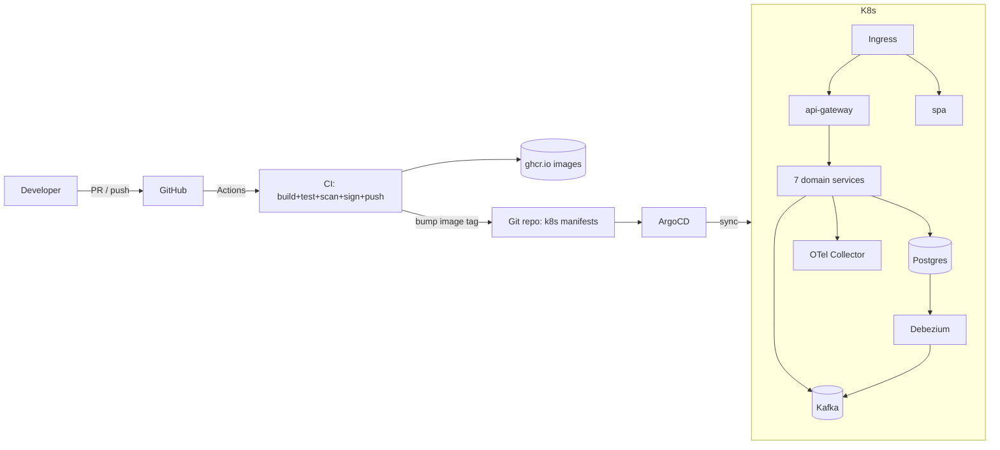

# EcommerceDDD — Kubernetes Migration & CI/CD Plan

**Author:** DevOps Engineering
**Scope:** Migrate the current Docker Compose–based EcommerceDDD platform to Kubernetes, and implement CI (GitHub Actions) + CD (Argo CD, GitOps pull model).
**Status:** Draft v1

---

## 1. Goals & Non‑Goals

### Goals
- Run all EcommerceDDD workloads on Kubernetes on a single **Minikube** cluster in the `dev` namespace only.
- Immutable, versioned container images published to a registry (GHCR).
- Automated build/test/scan/push on every PR and merge (GitHub Actions).
- Declarative, Git‑backed deployments via **Argo CD** using the **App‑of‑Apps** pattern.
- GitOps-driven deployment to `dev` only (no `staging`/`prod` resource creation in this phase).
- Zero secrets in Git. Progressive rollout, health‑gated, easily rollback‑able.

### Non‑Goals (initial phase)
- Rewriting services to use a service mesh (Istio/Linkerd) — deferred.
- Multi‑region active/active — deferred.
- Migrating PostgreSQL/Kafka to external managed services in phase 1 (kept in‑cluster with operators).

---

## 2. Current State Inventory

Sourced from [docker-compose.yml](../docker-compose.yml) and [docker-compose.infra.yml](../docker-compose.infra.yml).

### Application services (.NET 10, one Dockerfile each)
| Component | Kind | Port | Depends on |
|---|---|---|---|
| `ecommerceddd-identityserver` | Crosscutting (OAuth/OIDC) | 5001→80 | Postgres |
| `ecommerceddd-apigateway` (Ocelot) | Edge | 5000→80 | IdentityServer + all svc |
| `ecommerceddd-signalr` | Push notifications | 5002→80 | IdentityServer, OrderProcessing |
| `ecommerceddd-customer-management` | Service | 8001→80 | Postgres, IdentityServer |
| `ecommerceddd-product-catalog` | Service | 8002→80 | Postgres, IdentityServer |
| `ecommerceddd-inventory-management` | Service | 8003→80 | Postgres, ProductCatalog |
| `ecommerceddd-quote-management` | Service | 8004→80 | Postgres, ProductCatalog |
| `ecommerceddd-order-processing` | Service | 8005→80 | Postgres, Kafka, Connect |
| `ecommerceddd-payment-processing` | Service | 8006→80 | Postgres, Kafka, Connect |
| `ecommerceddd-shipment-processing` | Service | 8007→80 | Postgres, Kafka, Connect |
| `ecommerceddd-spa` (Angular + nginx) | Frontend | 4200→80 | ApiGateway |

### Infrastructure dependencies
| Component | Image | Purpose |
|---|---|---|
| PostgreSQL 18 (logical replication enabled) | `postgres:18` | Event store + read models (Marten) |
| Kafka (KRaft mode) | `confluentinc/cp-kafka:7.8.0` | Async integration |
| Debezium Connect | `debezium/connect:2.5` | CDC from Postgres → Kafka (outbox) |
| Kafka UI | `provectuslabs/kafka-ui` | Ops UI |
| pgAdmin | `dpage/pgadmin4` | Ops UI |
| Aspire Dashboard | `mcr.microsoft.com/dotnet/aspire-dashboard:9.1` | OTLP receiver (traces/metrics/logs) |

### Existing CI
- [.github/workflows/ecommerceddd-build.yml](../.github/workflows/ecommerceddd-build.yml): `dotnet restore/build/test` + Angular `jest`.
- [.github/workflows/e2e-cypress.yml](../.github/workflows/e2e-cypress.yml): Cypress E2E.

**Gaps to close:** no image build/push, no vulnerability scan, no SBOM, no image signing, no K8s manifests, no CD.

---

## 3. Target Architecture



### Repository strategy: **two repos** (recommended)
- `EcommerceDDD` (this repo) — application source. CI builds images, then opens a PR / commits to the config repo.
- `EcommerceDDD-gitops` (new) — Kubernetes manifests, Helm charts, Argo CD `Application` CRs, per‑environment overlays.

Rationale: separates “what to build” from “what is deployed where”. Prevents CI push loops on the source repo and matches Argo CD best practice.

> Acceptable alternative for a smaller team: keep a `deploy/` folder inside this monorepo. Same pipeline shape, just a different path.

### Cluster topology (per environment)
- Namespaces: `ecom-dev`, `platform` (argocd, ingress, monitoring), `data` (postgres, kafka).
- Ingress: **ingress-nginx** + local TLS managed outside the cluster via `mkcert`-generated Kubernetes TLS secrets.
- Storage: Minikube `local-path` `StorageClass` for Postgres/Kafka PVCs.

---

## 4. Prerequisites & Tooling

| Concern | Choice | Why |
|---|---|---|
| Target cluster | **minikube** | Single-cluster local deployment target |
| Packaging | **Helm 3** charts per service + **Kustomize** overlays for envs | Helm for templating, Kustomize for env deltas |
| GitOps | **Argo CD** with App‑of‑Apps | Standard, declarative, drift detection |
| Registry | **GHCR** (`ghcr.io/<org>/ecommerceddd-*`) | Free for public/OSS, OIDC from Actions |
| Secrets | **Pre-created Kubernetes Secrets** (dev only) | Keeps secret values out of Git while allowing Minikube bootstrap via local `kubectl create secret` commands |
| DB in cluster | **CloudNativePG** operator (Postgres 18, logical replication supported) | HA, backups, PITR |
| Kafka in cluster | **Strimzi** operator (KRaft mode) | Production‑grade Kafka on K8s |
| Debezium | Strimzi **KafkaConnect** + **KafkaConnector** CRs | Native to Strimzi |
| Ingress | **ingress-nginx** | Simple, well‑supported |
| TLS | `mkcert` + manually managed Kubernetes TLS secrets | Local trusted certs without public DNS or an in-cluster certificate controller |
| Observability | **OpenTelemetry Collector** → Tempo/Loki/Prometheus (or Aspire Dashboard for dev only) | Existing OTLP config already wired |
| Progressive delivery (optional) | **Argo Rollouts** | Canary/blue‑green for prod |
| Image scanning | **Trivy** in CI | Free, thorough |
| Image signing | **cosign** (keyless via GitHub OIDC) | Supply‑chain integrity |

---

## 5. Phase 1 — Containerization Hardening

Before touching Kubernetes, tighten the images.

1. **Non‑root user** in every Dockerfile (`.NET` base already sets `APP_UID`; verify SPA nginx runs as non‑root, use `nginxinc/nginx-unprivileged` or add a user).
2. **Pin base images by digest** for reproducibility (`FROM mcr.microsoft.com/dotnet/aspnet:10.0@sha256:...`).
3. **Multi‑stage** already in place. Add `--configuration Release --self-contained false /p:PublishTrimmed=false` consistency.
4. Add `HEALTHCHECK` for local, but for K8s rely on **liveness/readiness probes** hitting `/health` (already exposed by services).
5. Add `.dockerignore` audit — ensure `bin/`, `obj/`, `node_modules/`, `.git/`, `**/*.user` are excluded.
6. **Externalize configuration:** every value currently in `appsettings.json` that varies by env must come from env vars (K8s `ConfigMap` / `Secret`). Verify: `ConnectionStrings__DefaultConnection`, `Services__*`, `TokenIssuerSettings__*`, `KafkaConsumer__ConnectionString`, `DebeziumSettings__*`.
7. Ensure services **bind to `0.0.0.0`** (already `ASPNETCORE_URLS=http://+:80`) — good.
8. Emit **OpenTelemetry** via `OTEL_EXPORTER_OTLP_ENDPOINT` env — already supported.

Deliverable: PR updating Dockerfiles + `.dockerignore` + a `docker-bake.hcl` (or just a build script) building all 11 images with consistent labels (`org.opencontainers.image.*`).

---

## 6. Phase 2 — Kubernetes Manifests (Helm + Kustomize)

### 6.1 Chart layout (in `EcommerceDDD-gitops` repo)

```
EcommerceDDD-gitops/
├── charts/
│   ├── ecommerceddd-service/          # generic .NET microservice chart (reused by all 7)
│   │   ├── Chart.yaml
│   │   ├── values.yaml
│   │   └── templates/
│   │       ├── deployment.yaml
│   │       ├── service.yaml
│   │       ├── configmap.yaml
│   │       ├── serviceaccount.yaml
│   │       ├── hpa.yaml
│   │       ├── networkpolicy.yaml
│   │       └── servicemonitor.yaml
│   ├── ecommerceddd-apigateway/
│   ├── ecommerceddd-identityserver/
│   ├── ecommerceddd-signalr/
│   └── ecommerceddd-spa/
├── envs/
│   ├── dev/
│   │   ├── kustomization.yaml
│   │   ├── values-*.yaml              # per-service overrides
│   │   └── ingress.yaml
│   └── README.md                       # note: staging/prod deferred
├── platform/
│   ├── argocd/                        # bootstrap
│   ├── ingress-nginx/
│   ├── external-secrets/
│   ├── cnpg/                          # CloudNativePG operator + Cluster CR
│   ├── strimzi/                       # Kafka + KafkaConnect + KafkaConnector
│   └── observability/                 # otel-collector, prometheus, grafana
└── apps/
    ├── root-app.yaml                  # App-of-Apps root
   └── dev-apps.yaml
```

### 6.2 Kubernetes objects per service (generic chart)
- `Deployment` (2 replicas dev, 3+ prod), rolling update strategy `maxSurge=1 maxUnavailable=0`.
- `Service` type `ClusterIP` on port 80.
- `ConfigMap` for non‑secret settings.
- `Secret` (via ExternalSecrets) for DB creds, IdentityServer client secret, Kafka SASL (if enabled).
- `ServiceAccount` per service (least privilege).
- `NetworkPolicy`: deny‑all by default; allow only from `api-gateway`, from same service (SignalR, DB, Kafka).
- `PodDisruptionBudget` (`minAvailable: 1`) for stateful/critical.
- `HorizontalPodAutoscaler` on CPU (start at 60%).
- **Probes**:
  - `readinessProbe`: `GET /health` initialDelay 10s
  - `livenessProbe`: `GET /health` initialDelay 30s, failureThreshold 6
  - `startupProbe`: `GET /health` failureThreshold 30 (matches long start_period in compose)
- `resources`: start with `requests: 100m/256Mi`, `limits: 500m/512Mi`; tune from metrics.
- `securityContext`: `runAsNonRoot: true`, `readOnlyRootFilesystem: true` (writable `/tmp` emptyDir), `allowPrivilegeEscalation: false`, drop ALL capabilities.

### 6.3 Ingress routing
```
api.<env>.ecommerceddd.<domain>   → ecommerceddd-apigateway:80
app.<env>.ecommerceddd.<domain>   → ecommerceddd-spa:80
id.<env>.ecommerceddd.<domain>    → ecommerceddd-identityserver:80  (needed for OIDC discovery from browser)
hub.<env>.ecommerceddd.<domain>   → ecommerceddd-signalr:80  (WebSocket enabled)
```
SignalR ingress annotations:
```yaml
nginx.ingress.kubernetes.io/proxy-read-timeout: "3600"
nginx.ingress.kubernetes.io/proxy-send-timeout: "3600"
nginx.ingress.kubernetes.io/affinity: "cookie"
```

### 6.4 Data & messaging
- **CloudNativePG `Cluster`** with `instances: 1` (dev), `postgresql.parameters: { wal_level: logical, max_wal_senders: "10", max_replication_slots: "10" }` — matches current compose `postgres` command. Create databases via a `SQL` bootstrap `Job` running `scripts/db_init.sql`.
- **Strimzi `Kafka`** in **KRaft** mode, 1 broker (dev), PVC per broker.
- **Strimzi `KafkaConnect`** + **`KafkaConnector`** CRs replacing today’s manual Debezium bootstrap.
- **`Topic`** CRs pre‑create `payments`, `shipments`, `orders`, plus Debezium CDC topics.

### 6.5 Secrets flow (dev only)
Use **pre-created Kubernetes Secrets** for the `dev` namespace in the Minikube cluster.
Every service references secrets via `envFrom: secretRef`. `appsettings.json` values stay only for defaults; overrides come from env.
Create or update the required Secrets out of band with `kubectl create secret` before syncing workloads that depend on them.

---

## 7. Phase 3 — CI (GitHub Actions)

### 7.1 Pipeline stages
1. **Lint & unit tests** (existing `ecommerceddd-build.yml` reused).
2. **Detect changed services** (paths filter) — only build what changed on PRs; build all on `main`.
3. **Build image** with Buildx, multi‑arch (`linux/amd64` first, `arm64` later).
4. **Scan** with Trivy (`--severity HIGH,CRITICAL --exit-code 1` on `main`; report‑only on PR).
5. **Generate SBOM** (`syft` → SPDX).
6. **Sign** image with `cosign` keyless (GitHub OIDC).
7. **Push** to GHCR with tags:
   - `sha-<git-sha>` (immutable, used by Argo CD)
   - `pr-<n>` for PR builds
   - `<branch>-latest` for convenience (never referenced by prod)
8. **Update gitops repo** (only on merge to `main`): open a PR (or direct commit to `env/dev`) that bumps the image tag in the corresponding `values-*.yaml`.

### 7.2 Reusable workflow (per service)
Create `.github/workflows/build-image.yml`:
- Inputs: `service_name`, `context`, `dockerfile`.
- Outputs: `image_tag`.
- Called from a matrix job listing all 11 components.

### 7.3 Auth to GHCR
- Use `permissions: { packages: write, id-token: write, contents: read }`.
- No PAT needed — use built‑in `GITHUB_TOKEN`.

### 7.4 Auth to gitops repo
- Use a **fine‑scoped GitHub App** installed on both repos (preferred), or a `PAT` stored as `GITOPS_TOKEN` secret. GitHub App is preferred: no expiring PAT, per‑repo permissions.
- Update step:
  ```bash
  yq -i '.image.tag = strenv(TAG)' envs/dev/values-order-processing.yaml
  git commit -am "chore(dev): bump order-processing to ${TAG}"
  git push
  ```

### 7.5 PR previews (optional, phase 4)
On PR, deploy to an ephemeral namespace `ecom-pr-<n>` via a lightweight Argo CD `ApplicationSet` that watches PRs. Torn down on close.

### 7.6 Concurrency & caching
- `concurrency: { group: build-${{ github.ref }}-${{ matrix.service }}, cancel-in-progress: true }`.
- Buildx GHA cache: `cache-from: type=gha`, `cache-to: type=gha,mode=max`.
- `dotnet` NuGet cache via `actions/cache` keyed on `**/*.csproj` + `Directory.Packages.props`.

---

## 8. Phase 4 — CD (Argo CD, GitOps)

### 8.1 Install
Install Argo CD via Helm into `platform` namespace. Bootstrap through a single `kubectl apply -k platform/argocd/` — then Argo CD manages **itself** (self‑managed pattern).

### 8.2 App-of-Apps
`apps/root-app.yaml` (installed once, manually):
```yaml
apiVersion: argoproj.io/v1alpha1
kind: Application
metadata:
  name: root
  namespace: argocd
spec:
  project: default
  source:
    repoURL: https://github.com/<org>/EcommerceDDD-gitops
    path: apps
    targetRevision: main
  destination: { server: https://kubernetes.default.svc, namespace: argocd }
  syncPolicy:
    automated: { prune: true, selfHeal: true }
```
`apps/dev-apps.yaml` then declares one `Application` per chart, pointed at `envs/dev/`.

### 8.3 Sync policy (dev)
| Env | Auto‑sync | Self‑heal | Prune | Manual approval |
|---|---|---|---|---|
| dev | yes | yes | yes | no |

Staging/prod namespaces are intentionally not created in this implementation phase.

### 8.4 Progressive delivery (optional, phase 5)
Wrap `payment-processing` and `order-processing` in **Argo Rollouts** `Rollout` resources in `dev` for controlled rollout validation.

### 8.5 Drift & rollback
- Argo CD self‑heal reverts manual `kubectl edit`s.
- Rollback = `git revert` in the gitops repo (single source of truth).

---

## 9. Cross‑Cutting Concerns

### 9.1 Configuration mapping (compose → K8s)
| Compose env / host | K8s equivalent |
|---|---|
| `postgres` hostname | `Service` DNS: `ecom-pg-rw.data.svc.cluster.local` |
| `kafka:29092` | `ecom-kafka-kafka-bootstrap.data.svc.cluster.local:9092` |
| `connect:8083` | `ecom-connect-connect-api.data.svc.cluster.local:8083` |
| `http://ecommerceddd-*` service URLs | `http://ecommerceddd-*.ecom-<env>.svc.cluster.local` |
| `OTEL_EXPORTER_OTLP_ENDPOINT` | `http://otel-collector.platform.svc.cluster.local:4317` |

All wired via `ConfigMap` per env, mounted as `envFrom`.

### 9.2 Secrets to externalize
- `POSTGRES_PASSWORD` (currently `P@55w0rd` in compose — **rotate before prod**)
- IdentityServer signing keys + client secrets (currently in `appsettings.json`)
- `TokenIssuerSettings__ClientSecret`
- `PGADMIN_DEFAULT_PASSWORD` (dev only)
- Any external API keys added later

### 9.3 Observability
- Deploy **OpenTelemetry Collector** DaemonSet + Deployment; expose OTLP `4317`/`4318`.
- Export to **Tempo** (traces), **Loki** (logs via Fluent Bit), **Prometheus** (metrics). Grafana dashboards seeded via ConfigMap.
- Dev only: keep Aspire Dashboard as a `Deployment` for developer inspection.
- SLOs: 99.5% success rate on `apigateway`, p95 < 300ms.

### 9.4 Security
- **Pod Security Standards** `restricted` on all app namespaces.
- **NetworkPolicies** default‑deny egress except DNS/Postgres/Kafka/OTel + explicit inter‑service allows.
- Trivy in CI + **kube-bench** / **kubescape** run weekly on the cluster.
- Signed images verified at admission with **sigstore policy-controller** (phase 5).
- No `LoadBalancer` services except ingress-nginx. Everything else `ClusterIP`.

### 9.5 Backups & DR
- CNPG scheduled backups → local backup PVC or S3-compatible storage endpoint (for example MinIO) available from Minikube.
- Kafka: mirror critical topics to a second cluster in phase 5.
- Argo CD state is reproducible from Git → cluster loss is recoverable via re‑bootstrap.

---

## 10. Environment Strategy

| Env | Cluster | Trigger | Data | Purpose |
|---|---|---|---|---|
| **dev** | minikube (`ecom-dev` namespace) | auto on `main` merge | synthetic seed | Integration |

Staging/prod are deferred and must not be created during this implementation.

---

## 11. Milestones & Deliverables

Each milestone = one PR set. Ordered, dependencies flow top‑down.

1. **M1 — Container hygiene** (source repo)
   - Harden all 11 Dockerfiles, `.dockerignore`, non‑root, digest pins.
   - Add `build-image.yml` reusable workflow.
2. **M2 — Local K8s bring‑up** (gitops repo)
   - Bootstrap minikube cluster script.
   - `platform/` charts: ingress-nginx, cnpg, strimzi, otel-collector.
   - `charts/ecommerceddd-service/` generic chart.
   - `envs/dev/` values for all 11 components.
   - `README` with `make up` / `make down`.
3. **M3 — CI image pipeline**
   - Matrix build+scan+sign+push for all services to GHCR.
   - Auto‑commit tag bump into gitops repo `envs/dev/`.
4. **M4 — Argo CD wiring**
   - Install Argo CD, apply App‑of‑Apps.
   - Verify auto‑sync in dev.
5. **M5 — Dev hardening**
   - Add dev-only policy checks, smoke tests, and rollback drills.
6. **M6 — Deferred environments prep (no deployment)**
   - Document staging/prod design only; do not create namespaces or resources.
   - Keep implementation bounded to `ecom-dev`.
7. **M7 — Optional hardening**
   - Argo Rollouts canaries on `order-processing` / `payment-processing`.
   - cosign verification admission policy.
   - PR preview environments via `ApplicationSet`.

---

## 12. Risks & Mitigations

| Risk | Impact | Mitigation |
|---|---|---|
| Debezium connector state loss when Postgres pod restarts | CDC gap → missed outbox events | Use CNPG with persistent WAL + Strimzi‑managed connector offsets in Kafka `CONNECT_OFFSETS` topic |
| SignalR sticky‑session behind ingress | Broken realtime for clients | Enable session affinity on the ingress, or use Redis backplane |
| IdentityServer URLs baked in tokens | Token audience mismatch across envs | Set `TokenIssuerSettings__Authority` per env via ConfigMap; use ingress hostname, not cluster DNS, for issuer |
| Kafka topic auto‑creation currently `true` | Topic sprawl / wrong partitioning in prod | Turn off `auto.create.topics.enable` in prod, pre‑declare via Strimzi `KafkaTopic` |
| Secrets today in `appsettings.json` (e.g. `ClientSecret`) | Credential leak | Rotate all, move to Secrets before any non‑dev deploy |
| Argo CD self‑heal reverting emergency `kubectl` fixes | Confusion during incidents | Documented incident runbook: pause auto‑sync, then fix via Git |
| Angular SPA bakes API URL at build time | Wrong API URL per env | Switch SPA to runtime config (fetch `/assets/config.json` mounted from ConfigMap) |

---

## 13. Immediate Next Actions

1. Confirm target Minikube profile sizing (CPU/RAM/disk) and local DNS hostnames.
2. Create empty `EcommerceDDD-gitops` GitHub repo + a GitHub App with `contents:write` on both repos.
3. Start **M1** PR in this repo: Dockerfile hardening + reusable build workflow.
4. Stand up **minikube** cluster + Argo CD to validate M2 end‑to‑end in `ecom-dev` only.

